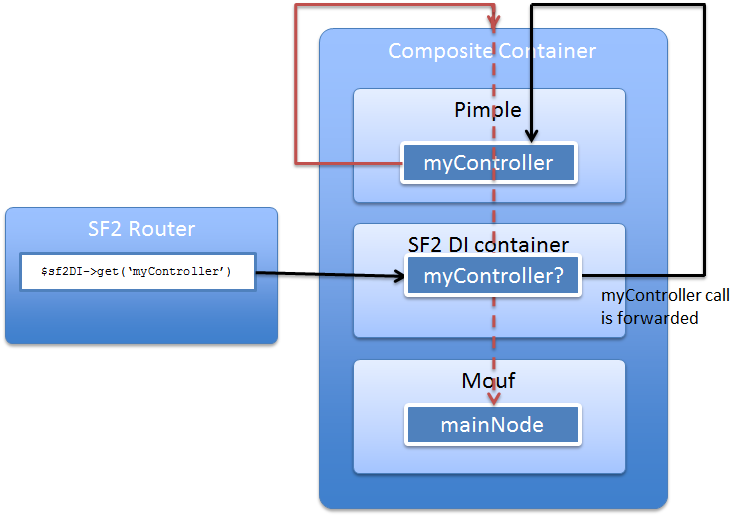

Extensible DI container for Symfony2
====================================

This package contains an `ExtensibleContainer` class that extends the `Container` class of Symfony 2.
The extended class will let you add additional dependency injection containers (DIC) to Symfony 2's container.

This means that when you develop a Symfony 2 application, you are no more forced into using Symfony's DIC only.
You can now use add any DIC you want!

How does it work?
-----------------

To make this work, you must put the Symfony2 container inside a composite container that will contain other containers.
There is a great implementation of a [`CompositeContainer`](https://github.com/jeremeamia/acclimate-container/blob/master/src/CompositeContainer.php) 
in the [Acclimate](https://github.com/jeremeamia/acclimate-container/) projet. 

The typical workflow will look like this:



The router (or any other component) will ask for an instance to the `ExtensibleContainer`. The `ExtensibleContainer`
will forward the call to the `CompositeContainer` that will in turn forward the call to any other container
in the `CompositeContainer`. To enter the `CompositeContainer`, a container must respect the `ContainerInterface`
as defined in the [container-interop project](https://github.com/container-interop/container-interop).

Installation
------------

The `ExtensibleContainer` is distributed as a [Composer package](https://packagist.org/packages/mouf/interop.symfony.di).
You will also typically need Acclimate (for the composite container) and other containers.

```
{
	// Let's replace container-interop as long as the ParentAwareContainerInterface is not adopted:
	"repositories" : [
		{
			"type" : "vcs",
			"url" : "git@github.com:moufmouf/container-interop.git"
		}
	],
	require: {
		... the dependencies to Symfony go here ...
		"mouf/interop.symfony.di" : "2.3.*",
		"acclimate/container" : "~1.0",
		// As long as the ParentAwareContainerInterface is not adopted by container-interop, you need this:
		"container-interop/container-interop" : "dev-parentaware as 1.0.0",
		// You will also need dependencies to the containers you want to use, for instance:
		"mouf/mouf" : "~2.0"
	}
}
```

In your `app/AppKernel.php` file, add these 2 methods:

```php
...

class AppKernel extends Kernel {
	...
	
	/**
	 * Gets the container's base class.
	 * We use this to make Symfony use the ExtensibleContainer.
	 *
	 * @return string
	 */
	protected function getContainerBaseClass()
	{
		return 'Mouf\\Symfony\\Component\\DependencyInjection\\ExtensibleContainer';
	}
	
	/**
	 * Initializes the service container.
	 *
	 * Use this method to initialize your own DI container and register it
	 * in Symfony DI container.
	 */
	protected function initializeContainer()
	{
		parent::initializeContainer();
	    	
		// Here, you can access the Symfony container using $this->container and register
		// your own container in it.
	
		$compositeContainer = new CompositeContainer();

		// The SF2 container does not implement the ContainerInterface interface
		// Therefore, it needs to be "acclimated".
    	$acclimator = new ContainerAcclimator();
    	$sfContainer = $this->container;
    	$sfContainer->setParentContainer($compositeContainer);
    	$acclimatedSfContainer = $acclimator->acclimate($this->container);
    	
    	$compositeContainer->addContainer($acclimatedSfContainer);
    	
    	// Now, let's add other containers.
    	// They must implement the ContainerInterface (and optionnally the ParentAwareContainerInterface)
    	$compositeContainer->addContainer(MoufManager::getMoufManager());
	}
}
```

Your DI container must respect the [`ContainerInterface` provided by the container-interop project.](https://github.com/container-interop/container-interop)

What DI containers can I plug in Symfony?
-----------------------------------------

Out of the box, you can plug these DI containers, because they respect the `ContainerInterface` interface:

- Mouf2 (http://mouf-php.com)
- PHP-DI 4.1+ (https://github.com/auraphp/Aura.Di)
- PimpleInterop (https://github.com/moufmouf/pimple-interop, a wrapper around Pimple)

But wait! Thanks to Jeremy Lindblom and its awesome [Acclimate package](https://github.com/jeremeamia/acclimate), you can now take almost any dependency injection container out there, and get an adapter on that container that respects the `ContainerInterface` interface.
